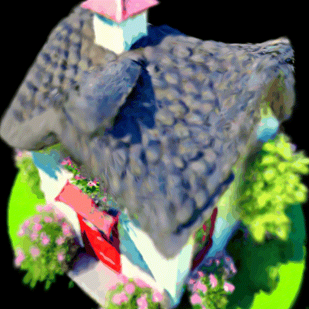
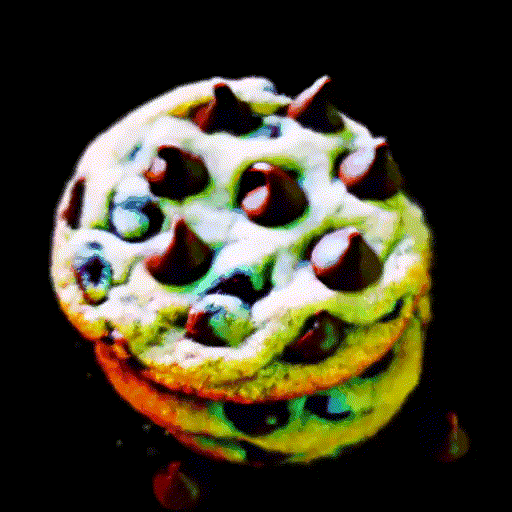
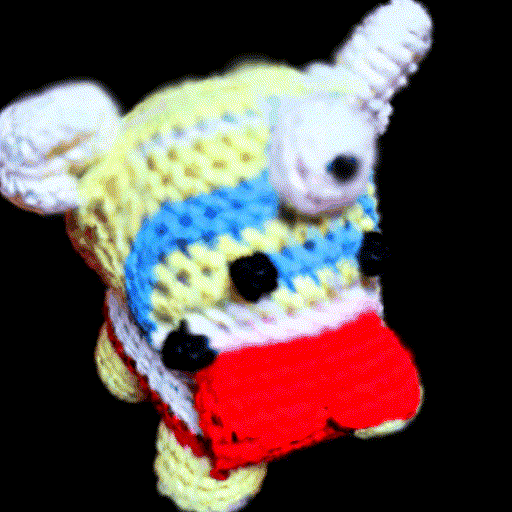
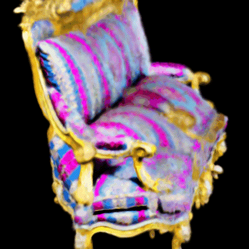
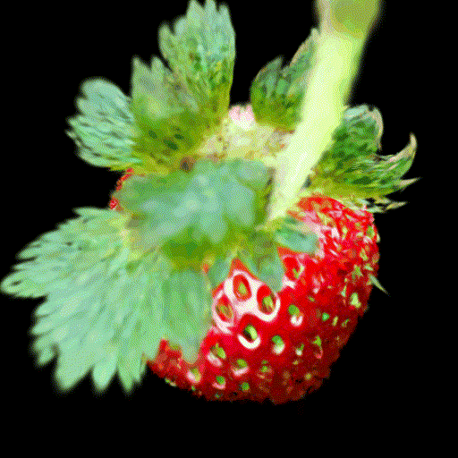

# More Comparisons

<table width="100%">
  <tr>
    <td width="33%" align="center">
      GaussianDreamer (CVPR 2024)
    </td>
    <td width="33%" align="center">
      GSGEN (CVPR 2024)
    </td>
    <td width="33%" align="center">
      Ours
    </td>
  </tr>
</table>

<table align="center">
  <!-- 第一行：放置三张图片 -->
  <tr>
    <td align="center">
      
    </td>
    <td align="center">
      
    </td>
    <td align="center">
      
    </td>
  </tr>
     <!-- 第二行：放置唯一的居中文本 -->
  <tr>
    <td colspan="3" align="center">
      A 3D model of an adorable cottage with a roof
    </td>
  </tr>
</table>

<table align="center">
  <!-- 第一行：放置三张图片 -->
  <tr>
    <td align="center">
      
    </td>
    <td align="center">
      
    </td>
    <td align="center">
      
    </td>
  </tr>
  <tr>
    <td colspan="3" align="center">
      A plate piled high with chocolate chip cookies
    </td>
  </tr>
</table>

<table align="center">
  <!-- 第一行：放置三张图片 -->
  <tr>
    <td align="center">
      
    </td>
    <td align="center">
      
    </td>
    <td align="center">
      
    </td>
  </tr>
  <tr>
    <td colspan="3" align="center">
     A DSLR photo of banana
    </td>
  </tr>
</table>

<table align="center">
  <!-- 第一行：放置三张图片 -->
  <tr>
    <td align="center">
      
    </td>
    <td align="center">
      
    </td>
    <td align="center">
      
    </td>
  </tr>
  <tr>
    <td colspan="3" align="center">
     A DSLR photo of lion
    </td>
  </tr>
</table>

<table align="center">
  <!-- 第一行：放置三张图片 -->
  <tr>
    <td align="center">
      
    </td>
    <td align="center">
      
    </td>
    <td align="center">
      
    </td>
  </tr>
  <tr>
    <td colspan="3" align="center">
     an asronaut
    </td>
  </tr>
</table>

<table align="center">
  <!-- 第一行：放置三张图片 -->
  <tr>
    <td align="center">
      
    </td>
    <td align="center">
      
    </td>
    <td align="center">
      
    </td>
  </tr>
  <tr>
    <td colspan="3" align="center">
     a kingfisher bird
    </td>
  </tr>
</table>

<table align="center">
  <!-- 第一行：放置三张图片 -->
  <tr>
    <td align="center">
      
    </td>
    <td align="center">
      
    </td>
    <td align="center">
      
    </td>
  </tr>
  <tr>
    <td colspan="3" align="center">
    a carousel with a red canopy
    </td>
  </tr>
</table>

<table align="center">
  <!-- 第一行：放置三张图片 -->
  <tr>
    <td align="center">
      
    </td>
    <td align="center">
      
    </td>
    <td align="center">
      
    </td>
  </tr>
  <tr>
    <td colspan="3" align="center">
    A zoomed out DSLR photo of an amigurumi bulldozer
    </td>
  </tr>
</table>

<table align="center">
  <!-- 第一行：放置三张图片 -->
  <tr>
    <td align="center">
      
    </td>
    <td align="center">
      
    </td>
    <td align="center">
      
    </td>
  </tr>
  <tr>
    <td colspan="3" align="center">
    a red rotary telephone
    </td>
  </tr>
</table>

<table align="center">
  <!-- 第一行：放置三张图片 -->
  <tr>
    <td align="center">
      
    </td>
    <td align="center">
      
    </td>
    <td align="center">
      
    </td>
  </tr>
  <tr>
    <td colspan="3" align="center">
    an opulent couch from the palace of Versailles
    </td>
  </tr>
</table>

<table align="center">
  <!-- 第一行：放置三张图片 -->
  <tr>
    <td align="center">
      
    </td>
    <td align="center">
      
    </td>
    <td align="center">
      
    </td>
  </tr>
  <tr>
    <td colspan="3" align="center">
    a ripe strawberry
    </td>
  </tr>
</table>

<table align="center">
  <!-- 第一行：放置三张图片 -->
  <tr>
    <td align="center">
      
    </td>
    <td align="center">
      
    </td>
    <td align="center">
      
    </td>
  </tr>
  <tr>
    <td colspan="3" align="center">
    a bunch of red rose
    </td>
  </tr>
</table>

# More 3D Assets

<table align="center">
  <tr>
    <td align="center">
       
      a fox
    </td>
    <td align="center">
       
      a bicycle
    </td>
    <td align="center">
       
      an french throne chair
    </td>
  </tr>
</table>

<table align="center">
  <tr>
    <td align="center">
       
      A goldfish
    </td>
    <td align="center">
       
      a high quality photo of a furry dog
    </td>
    <td align="center">
       
      a golden goblet
    </td>
  </tr>
</table>

<table align="center">
  <tr>
    <td align="center">
       
      a wooden chair
    </td>
    <td align="center">
       
      a delicious croissant
    </td>
    <td align="center">
       
      a green coffee mug
    </td>
  </tr>
</table>

<table align="center">
  <tr>
    <td align="center">
       
      a birthday cupcake
    </td>
    <td align="center">
       
      a yellow schoolbus
    </td>
    <td align="center">
       
      a cauliflower
    </td>
  </tr>
</table>

<table align="center">
  <tr>
    <td align="center">
       
      a lionfish
    </td>
    <td align="center">
       
      a brown boot
    </td>
    <td align="center">
       
      a lamp
    </td>
  </tr>
</table>

<table align="center">
  <tr>
    <td align="center">
       
      a red convertible car with the top down 
    </td>
    <td align="center">
       
      a typewriter
    </td>
    <td align="center">
       
      a cheeseburger
    </td>
  </tr>
</table>

